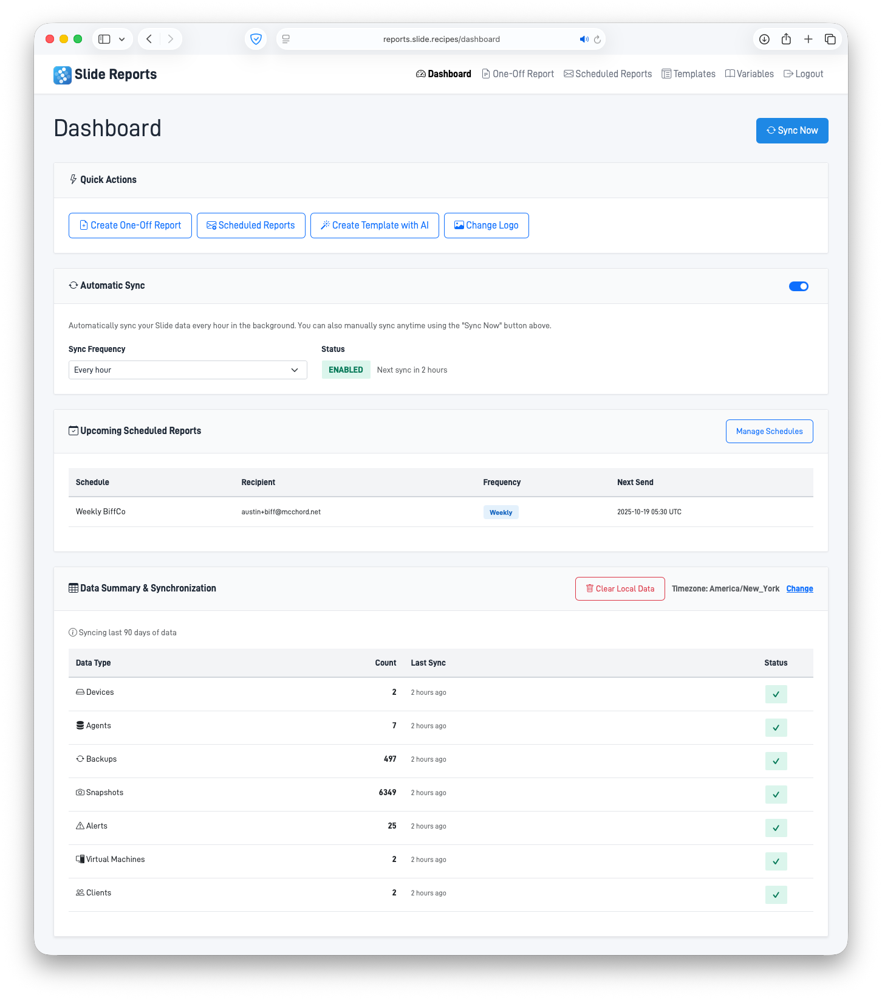
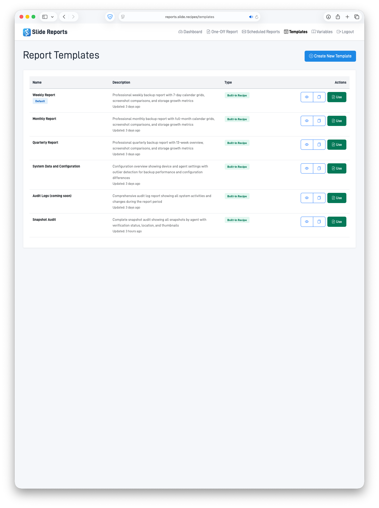
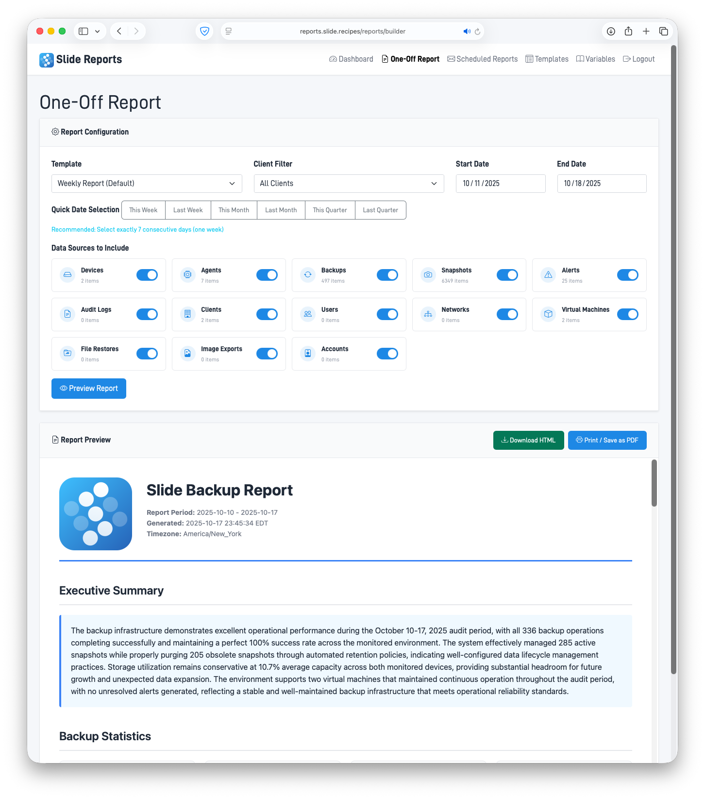
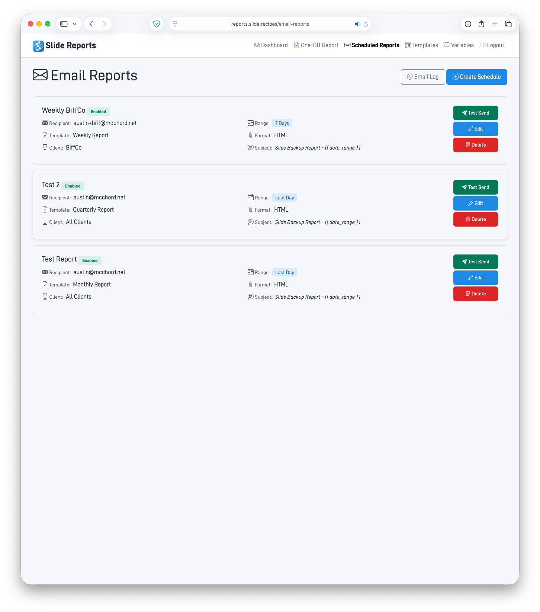
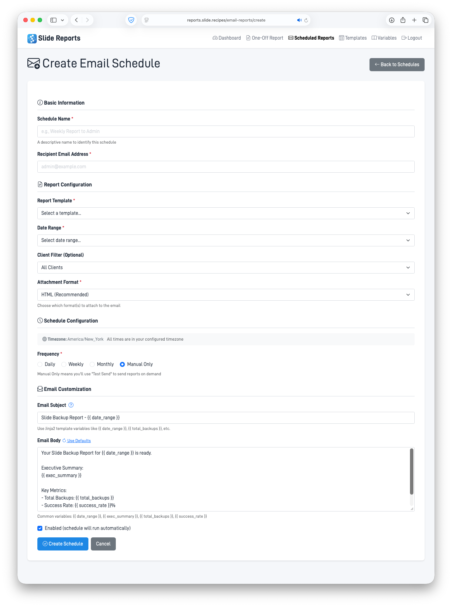

# Slide Reports System

A Flask-based web application for generating customizable reports about Slide backup data. Uses AI-powered template generation with Claude, SQLite for data caching, and encrypted API key storage for security.

**Author:** Austin McChord  
**License:** MIT License

🌐 **Live Demo:** Check it out at [https://reports.slide.recipes](https://reports.slide.recipes)


*Watch a quick walkthrough of creating AI-generated templates and building custom reports.*

## Features

- **Secure Authentication**: Encrypted API key storage using cookies with auto-login support via URL
- **Admin Panel**: Administrative interface for managing templates and system settings
- **Auto-Sync**: Automatic data synchronization at configurable intervals (hourly by default)
- **Data Synchronization**: Manual and automatic sync of Slide data with progress tracking
- **AI-Powered Templates**: Generate custom report templates using natural language descriptions with Claude AI
  - Streaming generation for real-time feedback
  - Template improvement suggestions
  - Automatic error detection and fixing
  - Template testing before deployment
  - Clone existing templates
- **Template Editor**: Monaco-powered code editor with syntax highlighting for creating and customizing HTML templates
- **Flexible Report Builder**: Modern UI with visual data source toggles, date ranges, and template selection
- **Report Values Preview**: Comprehensive documentation of all available template variables and data structures
- **Agent Configuration Overview**: Advanced report data showing devices grouped with agents, backup performance metrics, and configuration outlier detection
- **Email Scheduling**: Schedule automated email reports with customizable frequency (daily, weekly, monthly)
- **PDF Generation**: Generate and email PDF reports using WeasyPrint
- **Email Delivery Logs**: Track email delivery status and history
- **Print/PDF Export**: Generate print-ready reports via browser
- **Multi-User Support**: Isolated databases per API key
- **Timezone Support**: Display times in user's preferred timezone (defaults to Eastern)
- **Custom Logo Upload**: Upload and use custom logos in reports (replaces default Slide logo)
- **Modern UI/UX**: Soft badge colors, improved card layouts, visual toggle switches, and icon-based navigation
- **Custom Fonts**: Includes Datto Din font family for professional branding

## Architecture

### Core Components

1. **Encryption Layer** (`lib/encryption.py`): AES-256-CBC encryption for API keys
2. **Database Layer** (`lib/database.py`): SQLite with per-user isolation
3. **API Client** (`lib/slide_api.py`): Slide API integration with pagination
4. **Sync Engine** (`lib/sync.py`): Data synchronization with progress tracking
5. **Template System** (`lib/templates.py`): Template CRUD and default template
6. **AI Generator** (`lib/ai_generator.py`): Claude integration for template generation
7. **Report Generator** (`lib/report_generator.py`): Report creation with data queries

## Installation

### Prerequisites

- Python 3.10+
- pip
- Virtual environment (recommended)

### Setup

1. **Clone/Navigate to the repository**:
   ```bash
   cd /var/www/reports.slide.recipes
   ```

2. **Activate virtual environment**:
   ```bash
   source venv/bin/activate
   ```

3. **Install dependencies**:
   ```bash
   pip install -r requirements.txt
   ```

4. **Configure environment variables**:
   Create a `.env` file with the following variables:
   
   ```bash
   # Required
   ENCRYPTION_KEY=<32-character hex string>  # Generate with: python -c "import os; print(os.urandom(16).hex())"
   CLAUDE_API_KEY=<your-anthropic-api-key>
   FLASK_SECRET_KEY=<random-secret-key>
   
   # Email Configuration (for scheduled reports)
   SMTP_SERVER=smtp.gmail.com
   SMTP_PORT=587
   SMTP_USERNAME=<your-email@example.com>
   SMTP_PASSWORD=<your-app-password>
   SMTP_FROM_EMAIL=<sender-email@example.com>
   SMTP_FROM_NAME=Slide Reports
   
   # Admin (optional - for admin panel access)
   ADMIN_PASS=<secure-admin-password>
   ```

5. **Create data directory**:
   ```bash
   mkdir -p data
   ```

## Running the Application

### Development

```bash
source venv/bin/activate
python app.py
```

The application will be available at `http://localhost:5000`

### Production (with Gunicorn)

```bash
source venv/bin/activate
gunicorn -w 4 -b 0.0.0.0:5000 wsgi:app
```

## Usage

### First Time Setup

1. Navigate to the application URL
2. Enter your Slide API key (starts with `tk_`)
3. The key will be encrypted and stored in a secure cookie

#### Auto-Login via URL

You can also auto-login by passing your API key directly in the URL:

```
https://reports.slide.recipes/setup?api_key=YOUR_API_KEY
```

**Try the demo:**
```
https://reports.slide.recipes/setup?api_key=tk_4xgc378i7hfe_Ww1yeInkVpxy0Y2JBlClo6IvJjCLpQzL
```

This feature:
- Validates the API key before logging in
- Only works on first-time setup (unless using the demo key above)
- Automatically redirects to the dashboard on success
- Perfect for quick demos and testing

### Dashboard

- View data summary and sync status
- Change timezone preference
- Configure auto-sync settings
- Upload custom logo
- Quick access to report builder and templates



### Data Synchronization

#### Manual Sync

1. Click "Sync Now" on the dashboard
2. Watch real-time progress as data sources are synced
3. All data is stored locally in SQLite for fast report generation

#### Auto-Sync

1. Enable auto-sync from the dashboard settings
2. Configure sync frequency (default: 1 hour)
3. System automatically syncs data in the background
4. View next scheduled sync time on the dashboard

Data sources synced:
- Devices
- Agents
- Backups
- Snapshots (including deleted)
- Alerts
- Audits
- Clients
- Users
- Networks
- Virtual Machines
- File Restores
- Image Exports
- Accounts

### Creating Templates



#### Option 1: AI Generation with Streaming

1. Navigate to Templates → Create New Template
2. Select data sources to include
3. Describe your desired template in natural language
4. Click "Generate Template with AI"
5. Watch the template generate in real-time with streaming output
6. Preview and save the template

Example description:
```
Create a professional backup report with a blue header, 
metric cards showing backup success rates, storage usage 
progress bars, and a table of recent backups sorted by date.
```

#### Option 2: Manual Creation

1. Create a template using the AI generator
2. Edit the generated HTML directly
3. Use Jinja2 template syntax for dynamic data
4. Preview changes in real-time

#### Advanced Template Features

- **AI Improvements**: Ask Claude to improve specific aspects of your template
- **Error Detection**: Automatically detect and fix template errors
- **Template Testing**: Test templates with real data before saving
- **Clone Templates**: Duplicate existing templates as a starting point
- **Live Preview**: See changes in real-time as you edit

### Building Reports

1. Navigate to "One-Off Report"
2. Select a template from the dropdown
3. Choose date range (defaults to last 30 days)
4. Use the visual toggle switches to select which data sources to include
   - Each data source shows an icon, name, and item count
   - Toggle switches provide clear on/off states
   - All sources are enabled by default
5. Click "Preview Report" to generate
6. Print or save as PDF using browser's print function



### Report Values Preview

The Report Values page provides comprehensive documentation for template developers:

- **Complete variable reference**: All available Jinja2 template variables
- **Data structure documentation**: Detailed schemas for each data source
- **Usage examples**: Code snippets showing how to use each variable
- **Agent Configuration Overview**: Advanced dataset with:
  - Devices grouped with their agents
  - Backup performance metrics (duration, success/failure)
  - Configuration outlier detection
  - Formatted timestamps and IP addresses
  - Screenshot URLs for snapshot visualization

### Email Scheduling

Schedule automated report delivery via email:

1. Navigate to "Email Reports" from the dashboard
2. Click "Create New Schedule"
3. Configure the schedule:
   - **Name**: Descriptive name for the schedule
   - **Template**: Select from your saved templates
   - **Recipients**: Comma-separated email addresses
   - **Frequency**: Daily, Weekly, or Monthly
   - **Time**: When to send (in your timezone)
   - **Date Range**: How far back to include data (7, 14, 30, 60, or 90 days)
   - **Data Sources**: Select which data to include in the report
4. Click "Save Schedule"
5. Use "Test Email" to verify delivery before enabling
6. View delivery history in the Email Log

Reports are automatically generated as PDFs and emailed to recipients based on the schedule.





### Custom Logo Upload

Personalize your reports with a custom logo:

1. Navigate to "Logo Settings" from the dashboard
2. Click "Choose File" to select your logo image
3. Preview the logo before uploading
4. Click "Upload Logo" to save
5. Your custom logo will replace the default Slide logo in all reports
6. Delete the custom logo anytime to restore the default

Supported formats: PNG, JPG, SVG (recommended size: 200x50px)

## Data Sources

Each data source tracks specific metrics:

- **Backups**: Success/failure rates, duration, per-agent status
- **Snapshots**: Active/deleted counts, local/cloud storage
- **Alerts**: Total/unresolved/resolved counts
- **Storage**: Device usage, percentages, trends
- **Audits**: Activity logs, action counts
- **Virtualization**: VM counts, states

## Security

### API Key Protection

- API keys are never stored in plain text
- AES-256-CBC encryption with secure random IVs
- Keys stored in httpOnly cookies
- Each user gets isolated database (filename: `{api_key_hash}.db`)

### Best Practices

1. Use strong `ENCRYPTION_KEY` (32 hex characters)
2. Use strong `FLASK_SECRET_KEY`
3. Never commit `.env` file
4. Use HTTPS in production
5. Regularly update dependencies

## API Endpoints

### Authentication

- `POST /api/setup` - Save encrypted API key

### Sync

- `POST /api/sync` - Trigger data sync
- `GET /api/sync/status` - Get sync progress
- `GET /api/data/sources` - List data sources with counts

### Templates

- `GET /templates` - List all templates
- `GET /templates/new` - Create template page
- `GET /templates/{id}` - Edit template
- `POST /api/templates` - Create template
- `PATCH /api/templates/{id}` - Update template
- `DELETE /api/templates/{id}` - Delete template
- `POST /api/templates/{id}/clone` - Clone existing template
- `POST /api/templates/generate` - Generate with AI
- `POST /api/templates/generate-stream` - Generate with AI (streaming)
- `POST /api/templates/improve` - Improve template with AI
- `POST /api/templates/test` - Test template with real data
- `POST /api/templates/fix-error` - Automatically fix template errors

### Admin

- `GET /admin/login` - Admin login page
- `POST /api/admin/login` - Admin authentication
- `GET /admin` - Admin dashboard
- `POST /admin/api/keys/{api_key_hash}/auto-sync` - Toggle auto-sync for user
- `DELETE /admin/api/keys/{api_key_hash}` - Delete user data
- `DELETE /admin/api/email-schedules/{api_key_hash}/{id}` - Delete user's email schedule

### Reports

- `GET /reports/builder` - Report builder interface
- `GET /reports/values` - Report values preview interface
- `POST /api/reports/preview` - Generate preview
- `POST /api/reports/values` - Get available report data values

### Email Scheduling

- `GET /email-reports` - List all scheduled email reports
- `GET /email-reports/create` - Create new email schedule
- `GET /email-reports/edit/{id}` - Edit email schedule
- `GET /email-reports/log` - View email delivery logs
- `GET /api/email-schedules` - Get all schedules (JSON)
- `POST /api/email-schedules` - Create new schedule
- `GET /api/email-schedules/{id}` - Get schedule details
- `PATCH /api/email-schedules/{id}` - Update schedule
- `DELETE /api/email-schedules/{id}` - Delete schedule
- `POST /api/email-schedules/{id}/test` - Send test email

### Preferences

- `POST /api/preferences/timezone` - Set timezone
- `POST /api/preferences/auto-sync` - Toggle auto-sync and set frequency
- `GET /api/sync/next` - Get next scheduled sync time
- `POST /api/preferences/logo` - Upload custom logo
- `DELETE /api/preferences/logo` - Delete custom logo
- `GET /logo-settings` - Logo settings page

## Database Schema

Each user's SQLite database contains:

- `user_preferences` - Timezone and other settings
- `sync_status` - Last sync timestamps and status
- `devices`, `agents`, `backups`, `snapshots` - Slide data
- `alerts`, `audits`, `clients`, `users` - Additional data
- `networks`, `virtual_machines`, `file_restores`, `image_exports`
- `accounts`
- `email_schedules` - Scheduled email report configurations
- `email_logs` - Email delivery history and status

Templates are stored in separate database: `{api_key_hash}_templates.db`

## Troubleshooting

### Sync Errors

- **401 Unauthorized**: API key invalid or expired
- **429 Rate Limited**: Too many requests, sync will auto-retry
- **500 Server Error**: Check logs for details

### Template Generation Errors

- **Claude API Error**: Check CLAUDE_API_KEY in `.env`
- **Generation timeout**: Try simpler description
- **Invalid HTML**: Edit manually in advanced section

### Email Scheduling Errors

- **SMTP Authentication Failed**: Verify SMTP credentials in `.env`
- **Connection Timeout**: Check SMTP_SERVER and SMTP_PORT settings
- **PDF Generation Failed**: Ensure WeasyPrint dependencies are installed
- **Test Email Not Received**: Check spam folder, verify recipient email addresses
- **Schedule Not Running**: Check that the Flask application is running continuously

### Database Issues

- **Locked database**: Close other connections
- **Corrupted database**: Delete `data/{hash}.db` and re-sync
- **Missing tables**: Database will auto-initialize on first use

## Development

### Project Structure

```
/var/www/reports.slide.recipes/
├── app.py                 # Main Flask application
├── wsgi.py               # Gunicorn entry point
├── requirements.txt      # Python dependencies
├── .env                  # Environment variables (not in git)
├── .env.example          # Environment template
├── lib/                  # Core library modules
│   ├── encryption.py     # API key encryption
│   ├── database.py       # SQLite management
│   ├── slide_api.py      # Slide API client
│   ├── sync.py           # Data synchronization
│   ├── templates.py      # Template management
│   ├── ai_generator.py   # Claude integration
│   ├── report_generator.py # Report generation
│   ├── scheduler.py      # Auto-sync scheduler
│   ├── email_scheduler.py # Email report scheduler
│   ├── email_schedules.py # Email schedule management
│   ├── email_service.py  # Email sending service
│   ├── pdf_service.py    # PDF generation
│   ├── admin_utils.py    # Admin utilities
│   └── builtin_templates.py # Default templates
├── templates/            # Jinja2 HTML templates
│   ├── base.html
│   ├── setup.html
│   ├── dashboard.html
│   ├── templates_list.html
│   ├── template_editor.html
│   ├── report_builder.html
│   ├── report_values.html
│   ├── email_reports.html
│   ├── email_reports_create.html
│   ├── email_reports_edit.html
│   ├── email_log.html
│   ├── logo_settings.html
│   ├── admin_login.html
│   ├── admin.html
│   └── error.html
├── static/               # Static assets
│   ├── css/
│   │   ├── bootstrap.min.css
│   │   ├── bootstrap-icons.css
│   │   └── style.css
│   ├── js/
│   │   ├── main.js
│   │   └── email_reports.js
│   ├── img/
│   │   └── logo.png
│   └── fonts/
│       └── dattoDin/     # Datto Din font family
├── docs/                 # Documentation and media
│   ├── QuickDemoSmall.mov  # Quick demo video
│   ├── dashboard.png
│   ├── templates.png
│   ├── one-off-report.png
│   ├── email-reports.png
│   ├── create-email.png
│   ├── testReport.html   # Sample report
│   ├── slideAPI.json
│   └── slideLogoTemplate.png
└── data/                 # SQLite databases (not in git)
```

### Adding New Features

1. **New data source**: Add to `SyncEngine.DATA_SOURCES`
2. **New API endpoint**: Add to `app.py` with `@require_api_key`
3. **New template variables**: Update `ReportGenerator._build_context` and document in `/api/templates/schema`
4. **New metric**: Add calculation method in `ReportGenerator`
5. **New report data structure**: Add to `ReportGenerator` and update Report Values documentation

### UI Customization

The application uses a modern, professional design system:

- **Color Palette**: Soft badge colors for status indicators (success, warning, danger, info)
- **Toggle Components**: Custom switches with smooth animations
- **Card Layouts**: Consistent spacing and border styles
- **Icons**: Bootstrap Icons for visual navigation
- **Responsive Grid**: Auto-fit grid layouts for data sources and cards
- **Typography**: Datto Din font family for branding consistency

## Testing

Test with the provided Slide API key:
```
tk_4xgc378i7hfe_Ww1yeInkVpxy0Y2JBlClo6IvJjCLpQzL
```

**View a sample report:** [docs/testReport.html](docs/testReport.html)

1. Setup API key via web interface
2. Sync all data sources
3. Create a template
4. Generate a report
5. Test print/PDF functionality

## Recent Updates

### Version 1.2.0 - AI Enhancements, Auto-Sync, and Custom Branding

- **Auto-Sync Feature**: Automatic background data synchronization
  - Configurable sync frequency (default: 1 hour)
  - Per-user enable/disable toggle
  - Dashboard displays next scheduled sync time
  - Admin can manage auto-sync for all users
- **AI-Powered Template Improvements**:
  - Streaming generation with real-time feedback
  - Ask Claude to improve specific aspects of templates
  - Automatic error detection and fixing
  - Test templates with real data before deployment
  - Clone existing templates
- **Custom Logo Upload**:
  - Upload custom logos to replace default Slide branding
  - Supports PNG, JPG, SVG formats
  - Logo appears in all generated reports
  - Easy delete/restore functionality
- **Enhanced Template Editor**:
  - Live streaming generation
  - Improved error handling
  - Better Monaco editor integration
- **Admin Enhancements**:
  - Manage user auto-sync settings
  - Delete user data and schedules
  - Enhanced user management interface

### Version 1.1.0 - UI/UX Improvements

- **Auto-Login Feature**: Added URL parameter support for automatic authentication
  - Pass `?api_key=YOUR_KEY` to setup page for instant login
  - Includes security checks to prevent session hijacking
  - Demo key always allowed for testing
- **Modern Report Builder UI**: 
  - Visual data source selection with icon-based toggle cards
  - Improved grid layout with responsive design
  - Custom toggle switches with smooth animations
  - Badge improvements with soft color palette
- **Enhanced Template Editor**:
  - Better syntax highlighting
  - Improved code organization
  - Real-time validation feedback
- **Agent Configuration Overview**: New advanced report data structure
  - Devices grouped with agents for better organization
  - Backup performance indicators (slow backups >30min, old backups >7 days)
  - Configuration outlier detection
  - Pre-formatted timestamps and data
- **UI Polish**: 
  - Soft badge colors throughout application
  - Improved card layouts and spacing
  - Better navigation flow
  - Cleaner email reports interface

## Version

Current version: 1.2.0

## Support

For issues or questions:
1. Check the Slide API documentation: https://docs.slide.tech
2. Review application logs
3. Open an issue on GitHub

## License

MIT License

Copyright (c) 2025 Austin McChord

Permission is hereby granted, free of charge, to any person obtaining a copy
of this software and associated documentation files (the "Software"), to deal
in the Software without restriction, including without limitation the rights
to use, copy, modify, merge, publish, distribute, sublicense, and/or sell
copies of the Software, and to permit persons to whom the Software is
furnished to do so, subject to the following conditions:

The above copyright notice and this permission notice shall be included in all
copies or substantial portions of the Software.

THE SOFTWARE IS PROVIDED "AS IS", WITHOUT WARRANTY OF ANY KIND, EXPRESS OR
IMPLIED, INCLUDING BUT NOT LIMITED TO THE WARRANTIES OF MERCHANTABILITY,
FITNESS FOR A PARTICULAR PURPOSE AND NONINFRINGEMENT. IN NO EVENT SHALL THE
AUTHORS OR COPYRIGHT HOLDERS BE LIABLE FOR ANY CLAIM, DAMAGES OR OTHER
LIABILITY, WHETHER IN AN ACTION OF CONTRACT, TORT OR OTHERWISE, ARISING FROM,
OUT OF OR IN CONNECTION WITH THE SOFTWARE OR THE USE OR OTHER DEALINGS IN THE
SOFTWARE.
